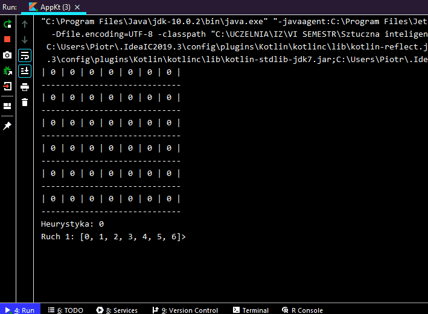

# connect-four-console
Console implementation of Connect Four game written in Kontlin for artiffical intelligence classes

The player wins if they set 4 tokens in a row, column or diagonal of the board.

You can play:
* player vs player,
* player vs AI,
* AI vs AI.

The AI player can be customized by choosing:
* algorithm - min-max or alpha-beta,
* heuristics - used for assessment of the situation on the board,
* search depth.

This version was used for measurments. Their results can be found in this file: 

https://github.com/PGliw/connect-four-console/blob/master/Choroscin_sprawozdanie_gry.pdf

If you are looking for version with browser-based GUI, check out this repo: 

https://github.com/PGliw/connect-four-browser
